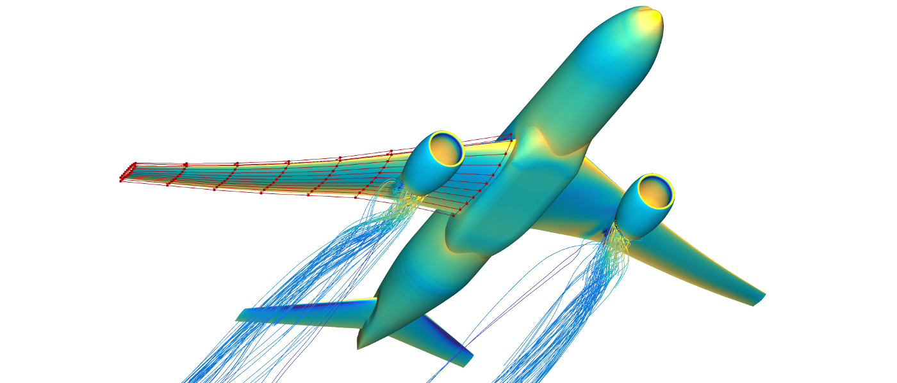

DAFoam: Discrete Adjoint with OpenFOAM
======================================

[](https://travis-ci.com/friedenhe/dafoam.svg?branch=v2)
[](https://coveralls.io/github/friedenhe/dafoam?branch=v2&kill_cache=1)

DAFoam contains a suite of adjoint solvers to efficiently compute derivatives. It also provides a Python interface to interact with a high-fidelity gradient-based design optimization framework (MACH). DAFoam is based on OpenFOAM and has the following features:

- It implements an efficient discrete adjoint approach with competitive speed, scalability, accuracy, and compatibility.
- It allows rapid discrete adjoint development for any steady and unsteady OpenFOAM primal solvers with modifying only a few hundred lines of source codes.
- It supports design optimizations for a wide range of disciplines such as aerodynamics, heat transfer, structures, hydrodynamics, and radiation.



Documentation
-------------

Refer to https://dafoam.github.io.

Citation
--------

If you use DAFoam in publications, we kindly ask you to cite the following papers.

Ping He, Charles A. Mader, Joaquim R.R.A. Martins, Kevin J. Maki. DAFoam: An open-source adjoint framework for multidisciplinary design optimization with OpenFOAM. AIAA Journal, 58:1304-1319, 2020. https://doi.org/10.2514/1.J058853

```
@article{DAFoamAIAAJ20,
	Author = {Ping He and Charles A. Mader and Joaquim R. R. A. Martins and Kevin J. Maki},
	Title = {{DAFoam}: An open-source adjoint framework for multidisciplinary design optimization with {OpenFOAM}},
	Journal = {AIAA Journal},
	Pages = {1304--1319},
	Volume = {58},
	Doi = {10.2514/1.J058853},
	Year = {2020}}
```

Ping He, Charles A. Mader, Joaquim R.R.A. Martins, Kevin J. Maki. An aerodynamic design optimization framework using a discrete adjoint approach with OpenFOAM. Computer & Fluids, 168:285-303, 2018. https://doi.org/10.1016/j.compfluid.2018.04.012

```
@article{DAFoamCAF18,
    Title = {An aerodynamic design optimization framework using a discrete adjoint approach with {OpenFOAM}},
	Author = {Ping He and Charles A. Mader and Joaquim R. R. A. Martins and Kevin J. Maki},
	Journal = {Computers \& Fluids},
	Pages = {285--303},
	Volume = {168},
	Doi = {10.1016/j.compfluid.2018.04.012},
	Year = {2018}}
```

License
-------

Copyright 2019 MDO Lab

Distributed using the GNU General Public License (GPL), version 3; see the LICENSE file for details.
